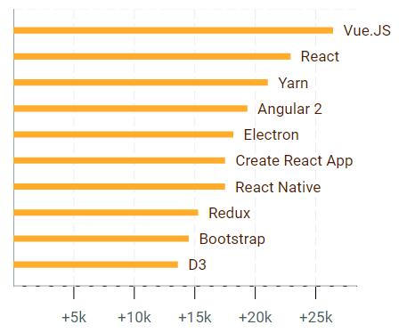
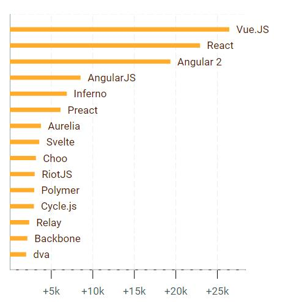
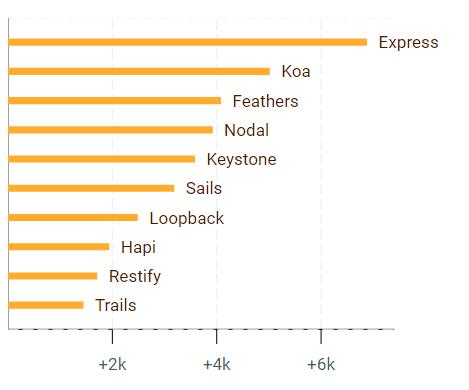
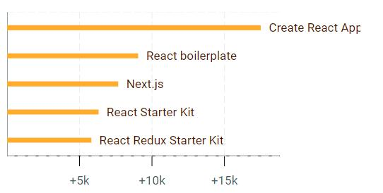
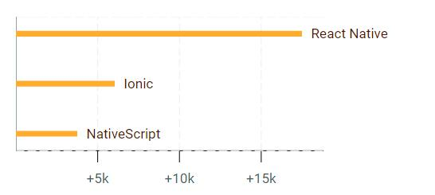
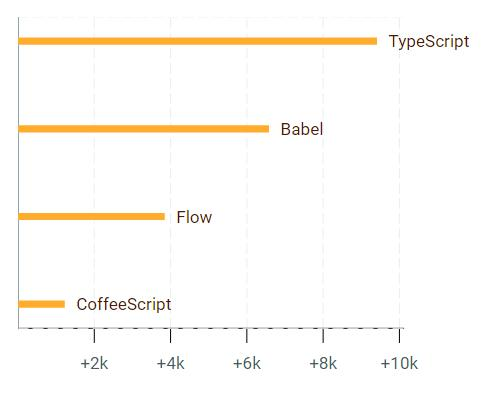
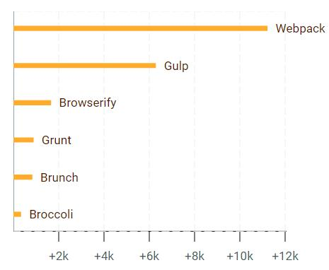
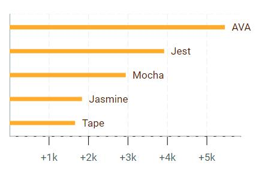
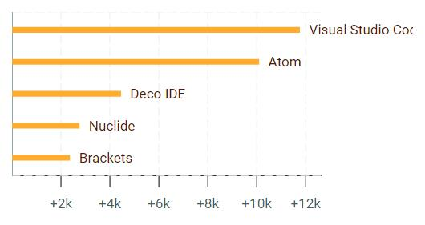
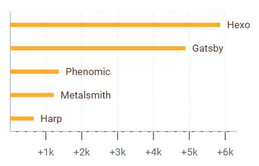

JavaScript 社区在创新方面全速前进，几个月后，曾经的趋势就会过时。

2016 结束了,你可能会想自己错过了一些重要的事情？别担心,我们将回顾一下主要的趋势。

让我们看看 **by the numbers** 这个在2016年推动的项目，它比较了在过去12个月，Github上  **added** 的 stars 数量。

在 2015年, [React](https://facebook.github.io/react/) 成为最大赢家 ， [Flux](http://facebook.github.io/flux/) 赢得了Flux实现的风暴之战。won by storm the battle of implementations.

谁是2016年JavaScript后起之秀呢？
* * *                  
###  目录

1.  [2016最流行的项目](#all)

2.  [前端框架](#framework)

3.  [Node.js 框架](#nodejs-framework)

4.  [React Boilerplates](#react-template)

5.  [Mobile](#mobile)

6.  [编译器](#compiler)

7.  [构建工具](#build)

8.  [测试框架](#test-framework)

9.  [IDE](#ide)

10.  [静态网站生成器](#ssg)
下面的图标对比了在过去12个月中，GitHub上 **added**的 stars。

我们分析了来自[bestof.js.org](http://bestof.js.org/)的项目，关于web平台的最佳项目清单。

#1、2016最流行的项目

### 回顾

通过检查一年中最火的10个项目，你可以得到一个很好的关于2016年Web开发环境是怎么样的回顾，你会发现： 

*   3个 UI 框架: [Vue.JS](http://vuejs.org), [React](https://facebook.github.io/react/) 和 [Angular 2](https://angular.io)

*   一个新的 node.js 包管理器: [Yarn](https://yarnpkg.com)

*   构建桌面应用的领先解决方案: [Electron](http://electron.atom.io)

*   快速开始一个新 React 项目的方案A [Create React App](https://github.com/facebookincubator/create-react-app)

*   移动框架: [React Native](http://facebook.github.io/react-native/)

*   最有名的 CSS 工具包: [Bootstrap](http://getbootstrap.com)

*  基于函数式的状态管理库 : [Redux](http://redux.js.org)

*   一个强大而又灵活的图标库: [D3](https://d3js.org)

它讲述了很多关于JavaScript在2016年无所不在和用途广泛的事。

###  2016年胜利者是...

[Vue.JS](http://vuejs.org) 去年在 Github 上获得了超过25，000 个stars, 这意味着一天72个stars，这比包括React和Angular在内的框架都多。

 [vue 2](https://medium.com/the-vue-point/vue-2-0-is-here-ef1f26acf4b8#.lekly4sa8), 利用虚拟DOM的性能,在去年十月份发布。

[Vue.JS](http://vuejs.org) 被一些大公司（包括阿里巴巴-中国最大的电子商务公司）在生产中使用，所以，你可以认为这是一个安全的选择。

它已经拥有相当成熟的生态系统，包括 router ([vue-router](http://router.vuejs.org/)) 和一个状态管理库 ([Vuex](https://github.com/vuejs/vuex)).

看起来 [Vue.JS](http://vuejs.org) 集 [React](https://facebook.github.io/react/) (组件方法)和 [AngularJS](http://angularjs.org) (由框架特色增强的html代码模板)于一身.

------------

#2前端框架

前端框架类应该对 [JavaScript 疲劳](https://medium.freecodecamp.com/javascript-fatigue-fatigue-66ffb619f6ce#.soeh5g56p) 负有一定责任。 
看起来，每个月一个新的竞争者做出了嗡嗡声，推动创新的步伐！

确切地说，在这个类别中，混合了两种类别的项目
 
*  包含所有功能的全能框架,创建现代web应用(路由, 数据获取, 状态管理). [AngularJS](http://angularjs.org), [Angular 2](https://angular.io), [Ember](http://www.emberjs.com) 或者 [Aurelia](https://github.com/aurelia/framework) 均属此类别。

*  UI层更轻的解决方案, 如 [React](https://facebook.github.io/react/), [Vue.JS](http://vuejs.org), [Inferno](http://infernojs.org)...

我们已经注意到[Vue.JS](http://vuejs.org)(总体第一),让我们看下其他的竞争者。

#### React 和他的竞争者

[React](https://facebook.github.io/react/) 位列第二,没有前端开发者可以忽视React和它的生态系统。

[React](https://facebook.github.io/react/) 是如此地受欢迎，以至于它鼓舞了众多其他库意图采用React的优点，没有多余的东西，旨在提高浏览器的性能和构建时间。 

[Inferno](http://infernojs.org) 是这个类别中最流行的项目,它声称是最快的可替代React的项目。

在我们的排名中，紧跟 Inferno 之后， [Preact](https://preactjs.com)也是一个良好的React 替代品。
它的生态系统相当成熟，例如，具有离线功能的模板、路由、模块，以至于你可以在你的项目中使用任何已经存在的React库。

#### Angular 1 和 2

Angular 项目分为2 个库，因为 Angular 2重写了Angular 1，尽管一些概念保持相同。

[Angular 2](https://angular.io) 用TypeScript编写，利用ES6 实现现代化、彻底的框架。

[AngularJS](http://angularjs.org)是1.x的分支, 它仍然在许多项目中使用，并将在一段时间内保持流行。

值得注意的是 [Ember](http://www.emberjs.com), 尽管有强大的生态系统和社区，依然未进入前10.

如此看来, 与其选择”开箱即用“的包含所有特征的框架，
开发者们在2016年 ，更加喜欢选择他们自己的解决方案”按菜单点菜“。

#3、Node.js 框架

在2016年，使用以下解决方案创建和部署node.js应用程序从未如此简单

*   [Now](https://zeit.co/now)

*   [Webtask.io](https://webtask.io/)

*   [Stdlib](https://stdlib.com/)

像Gomix项目甚至降低了Node.js的世界的门槛，
使得任何人都可以轻松地从浏览器中“点点点”书写和分享node.js代码。

那么问题来了，如果你想开发一个web程序，应该选择哪个框架呢？

#### [Express](https://expressjs.com)

当你使用 node.js 构建Web应用开发，[Express](https://expressjs.com)经常被考虑为事实上的web服务器。它的（一个简单的核心，你可以使用中间件包扩展）哲学为大多数node.js 开发者所熟悉。

#### [Koa](http://koajs.com)

[Koa](http://koajs.com)这些接近于 [Express](https://expressjs.com)。但它用ES6 生成器构建，避免有时被称为[回调地狱](https://www.sitepoint.com/saved-from-callback-hell/)的问题。

#### [Feathers](http://feathersjs.com)

[Feathers](http://feathersjs.com)是一种创建“面向服务”的体系结构的非常灵活的解决方案。
这是创建一个Node.js微服务不错的选择。

#### [Nodal](http://www.nodaljs.com/)
[Nodal](http://www.nodaljs.com/) 框架的目标是无状态和分布式服务连接到PostgreSQL数据库。

#### [Keystone](http://www.keystonejs.com)
[Keystone](http://www.keystonejs.com)是我所知得到一个管理客户端运行的最佳解决方案之一 ，
目的是管理从MongoDB数据库来的内容。
管理界面从模型自动生成，具有所有CRUD操作和友好的过滤器。

#### [Sails](http://sailsjs.com)

[Sails](http://sailsjs.com)是一个完整的MVC框架。 
受Ruby on Rails的启发（因此名为**S**ails!）.他已经问世很长时间了。
可以和任何类型的数据库使用，SQL或no-SQL。

#### [Loopback](http://loopback.io)

[Loopback](http://loopback.io)是一个有很多的内置功能，包括与令牌认证和连接到任何数据库的另一个成熟的框架。

他的杀手级特性是  **API explorer**，通过检查任何用户令牌的能力，以直观的方式让开发人员检查所有API端点。
如果你必须构建一个API，这绝对是一个不错的选择。

------------

#4、React Boilerplates

React 是一个伟大的 UI 库，但使用React和现代Web开发工作流工具需要大量的配置。
那么如何开始创建一个真实世界的应用程序呢？
这是 React "boilerplates" 和其他的“初学者工具包”给出的答案···

#### [创建 React App](https://github.com/facebookincubator/create-react-app)

Facebook 通过提供一个轻松的叫做[创建 React App](https://github.com/facebookincubator/create-react-app)方法实现需要， 
这是使得启动一个新 React 项目非常方便。

[Dan Abramov](https://github.com/gaearon) （Redux的创造者，现在在Facebook工作）做了一项伟大的工作，
找到简单和特征之间的正确平衡。 
例如，没有花哨的样式解决方案（只是简单的CSS），没有服务器端渲染，
但一切都被很好的打包，开发体验非常棒。

与其竞争者的主要区别是，如果使用Create React App，它将成为项目的依赖项，
所有的黑科技都是隐藏的，你看到的只是你的应用程序代码。 
您可以随时升级依赖关系，它不只是一个起点。

#### [React boilerplate](http://reactboilerplate.com)

名为React的样板文件有您需要的一切，
包括Redux和一些友好的离线功能，利用web工作者技术。

它让开发人员创建名为Progressive Web Applications（或PWA）的Web应用程序：
使用名为Service Worker的技术运行的离线Web应用程序，
阅读来自 Nicolás Bevacqua的[这篇文章](https://ponyfoo.com/articles/progressive-app-serviceworker) .

#### [Next.js](https://zeit.co/blog/next)

Next.js由忙碌的Zeit人员创建，具有服务器端呈现功能，
可用于创建通用应用程序（或同构应用程序，如我们在2015年所说），
亦即，在代码客户端和服务器端用差不多的代码运行应用程序。

------------

#5、Mobile

JavaScript无处不在，你可以使用已知的web开发技术 (HTML, JavaScript, CSS)构建原生移动应用。

#### [React Native](http://facebook.github.io/react-native/)

通过React Native，在同样的代码基础上，你可以构建IOS和Android原生移动应用，
使用React开发人员熟悉的概念。
想了解更多关于构建IOS和Android应用，阅读这个[教程](http://makeitopen.com/)

其他解决方案,基于 Cordova,依赖Webview来渲染屏幕，并且不如原生解决方案高效。 
"一次编写，到处运行"... 开发者梦想成真了!

#### [Ionic](http://ionicframework.com/)

[Ionic](http://ionicframework.com/) 是混合应用理念的先锋，在底层，它基于Cordova来访问移动设备功能。
它非常成熟，有着强大的生态系统。

#### [NativeScript](http://www.nativescript.org)

NativeScript旨在实现与React Native相同的目标（使用Web技术构建真正的移动应用程序）。 它有两种风格，NativeScript Core和NativeScript + Angular 2

####  展望未来..

一个在2017年密切关注的项目: [Weex](https://weex-project.io/), 
一个构建在Vue.JS之上的移动跨平台UI框架。

#6、编译器
 
 
我们在这里谈论生成任何语言（或JavaScript的任何变体）的JavaScript的编译器（或“transpilers”）。
他们将代码转换为浏览器（或node.js）可以执行的“标准JavaScript”代码。

例如，编译器允许开发人员使用最新版本的JavaScript（ES6）编写代码，而不必担心浏览器支持。

#### [TypeScript](http://www.typescriptlang.org)
 //todo
 
最流行的transpiler 是 [TypeScript](http://www.typescriptlang.org),它带给web开发者来自java和c#的静态 it brings to web developers the static types used by Java and C# developers.
The fact that [Angular 2](https://angular.io) uses TypeScript added even more traction.
There are pros and cons about using types in JavaScript, read these 2 article to make your own point of view:

阅读这两篇文章

*   [你也不并不需要 TypeScript](https://medium.com/javascript-scene/you-might-not-need-typescript-or-static-types-aa7cb670a77b#.1pn05vlis)

*   [TypeScript: the missing introduction](https://toddmotto.com/typescript-the-missing-introduction)

#### [Babel](https://babeljs.io/)

Babel与Webpack一起，几乎成为编译ES5代码和标准JavaScript中的库（如React（JSX））所使用的模板的标准。 
最初创建的编译ES6，它成为一个更通用的工具，可以完成任何代码转换，感谢这个插件系统。

#### [Flow](http://flowtype.org/)

[Flow](http://flowtype.org/)不是一个编译器，用 静态类型检查js代码。
 
[Flow](http://flowtype.org/) is not a compiler, it's a static type checker used to "annotate" the JavaScript code.
Basically using Flow inside a code base means adding comments to describe expected types (read more about using Flow to write modules [here](http://javascriptplayground.com/blog/2017/01/npm-flowjs-javascript/)).

It's used inside the code source of Facebook projects. Since Facebook became one of the major actors of the open source world (with projects like [React](https://facebook.github.io/react/), [React Native](http://facebook.github.io/react-native/), [Flux](http://facebook.github.io/flux/), [Immutable](http://facebook.github.io/immutable-js/), [Jest](http://facebook.github.io/jest/)...), 这意味着更多.

#### [CoffeeScript](http://coffeescript.org/)

吸取 Python 和Ruby 语法，
大量的开发者通过使用Babel从 CoffeeScript 转移到ES6。

During years [CoffeeScript](http://coffeescript.org/) and its lean syntax, inspired by Python and Ruby syntax, was the most popular compiler but it was less more trendy in 2016, a lot of developers moved from CoffeeScript to ES6 with Babel.

#7、Build Tools构建工具
  

在 2016年,我们很难想象一个没有任何构建过程的Web应用的 it's difficult to imagine a web application without any kind of building process.
You usually need a building process to compile templates and optimize assets in order to ship your web application in production.

#### [Webpack](https://webpack.js.org)

[Webpack](https://webpack.js.org) 是被用来构建单页应用的主要工具，在React生态系统中运行is the main tool used to build a single-page application, it plays well with the React eco-system. The newly released version 2 comes with some promising enhancements (check this [introduction](https://blog.madewithenvy.com/getting-started-with-webpack-2-ed2b86c68783#.7wyiawc0o))

#### [Gulp](http://gulpjs.com)

[Gulp](http://gulpjs.com) is a generic a task runner that can be used for any kind of automatic process involving the file system, so it's not a direct contender of Webpack or Browserify.

Like [Grunt](http://gruntjs.com/), Gulp works by aggregation: you can ask it to minify and concatenate a list of assets but it does not deal with modular JavaScript by itself, as [Webpack](https://webpack.js.org) or [Browserify](http://browserify.org/) do.

Nevertheless it can play well with webpack even if developers tend to use npm scripts instead.

开发者倾向于使用 npm 替代

#### [Browserify](http://browserify.org/)

[Browserify](http://browserify.org/),由于其简单的特性，通常深受node.js开发者的喜爱。

Basically it takes several node.js packages as an input and generates one single "build" file for the browser as an output. But it seems that a more opinionated tool like [Webpack](https://webpack.js.org) is a a better fit to web application workflows.

#### 展望未来...

在2017年应该关注的模块管理器,它强调性能: [rollup](http://rollupjs.org).

它使用ES6模块及一个称为”Tree shaking “功能创建包，
只包括您在代码中使用到的功能，而非传输整个库。It uses ES6 modules with a feature called _Tree shaking_ to create bundles that include only functions you use in your code, instead of shipping the full library.

------------

#8测试框架 
 

最有名的两个测试框架是 [Jasmine](http://jasmine.github.io/) 和 [Mocha](https://mochajs.org)， but 2 more recent projects got more traction in 2016: [AVA](https://github.com/avajs/ava) 和 [Jest](http://facebook.github.io/jest/).

#### [AVA](https://github.com/avajs/ava)

[AVA](https://github.com/avajs/ava), 由多产的 [Sindre Sorhus](https://github.com/sindresorhus)创建的强调性能（并行测试）和ES6。
AVA的语法接近标准测试框架，如[Tape](https://github.com/substack/tape) 和 [Node-tap](http://www.node-tap.org/)。

#### [Jest](http://facebook.github.io/jest/)

[Jest](http://facebook.github.io/jest/),另一个 Facebook 项目, got a lot of traction over the last weeks. It's well-known in the React community, more and more people are moving to Jest (read [this story](https://medium.com/@kentcdodds/migrating-to-jest-881f75366e7e#.z9x53j1ea) for example) and it may become the most popular testing framework in 2017.
在过去几周里有很多牵引力。 在React社区众所周知，越来越多的人转向Jest（例如阅读这个故事），
它可能成为2017年最流行的测试框架。
Jest has good mocking abilities built-in, whereas other testing frameworks usually rely on libraries like [Sinon.JS](http://sinonjs.org/).
Jest内置了良好的嘲笑能力，而其他测试框架通常依赖于[Sinon.JS]（http://sinonjs.org/）这样的库。

------------

#9、IDE
 

关于 IDE (_Integrated Development Environment_), it's worth to mention that 2 of the most popular IDEs are open-source projects made with web technologies.

#### [Visual Studio Code](http://code.visualstudio.com)

在我们的调查结果中，微软以[Visual Studio Code](http://code.visualstudio.com)带路。
In our results, Microsoft leads the way with [Visual Studio Code](http://code.visualstudio.com).

它提供了关于 [TypeScript](http://www.typescriptlang.org) 和 node.js的良好集成.
Some developers mention improvement about development speed thank to the _IntelliSense_ feature (a mix of highlighting  和自动完成).
微软和开源在同一句话里出现，没毛病！

#### [Atom](https://atom.io)

[Atom](https://atom.io), 由Github推出，pushed by Github and built with [Electron](http://electron.atom.io) (like several other 桌面应用, including the Slack desktop client) is not far behind [Visual Studio Code](http://code.visualstudio.com). 一个关于 Atom 有趣的事实是: 它主要的语言是 CoffeeScript!

------------

#10、静态网站生成器 

  
  
静态网站生成器是生成一系列.html, .css 和 JavaScript文件的工具，
您可以在任何简单的web服务器（Apache或NGNX）上部署，
而不用大惊小怪，或者设置数据库或任何web框架。
正如比尔盖茨所说：

Static site generators (or "SSG") are tools that generate a bunch of .html, .css and JavaScript files that you can deploy on any simple web server (Apache or NGNX) without the fuss or a setting up a database or any web framework.
As [Gatsby](https://github.com/gatsbyjs/gatsby) site says:

> Build sites like it's 1995

> 建站就像是在1995年

静态网站快速，强大，易于维护。

SSG非常受欢迎，因为有很多很好的免费解决方案解决静态网站：

*   [Github pages](https://pages.github.com/)

*   [Gitlab pages](http://pages.gitlab.io/)

*   [Netlify](https://www.netlify.com/)

*   [Surge](https://surge.sh/)

*   [Now static](https://zeit.co/blog/now-static)

#### [Hexo](http://hexo.io)
在2016年，
接近于像Wordpress这样的CMS系统，

In 2016, the most popular SSG built with node.js was [Hexo](http://hexo.io). It's a thorough SSG, close to CMS systems like Wordpress, that can be used to build a blog for example.
他有很多功能，包括国际化插件。

#### [Gatsby](https://github.com/gatsbyjs/gatsby)

新出的Gatsby是一个非常有趣的解决方案，它因为使用React生态系统来生成静态html文件，从竞争对手脱颖而出。
事实上，您可以组合React组件，Markdown文件和服务器端渲染使它非常强大。

#结论

尽管 JavaScript 疲劳™ 和 the dramas (还记得 ["leftpad gate"](http://developer.telerik.com/featured/left-pad-indicative-fragile-javascript-ecosystem/)), 
随着如 [Vue.JS](http://vuejs.org) 和 [React Native](http://facebook.github.io/react-native/)项目的崛起，
以及新项目如 [Yarn](https://yarnpkg.com) 或[Create React App](https://github.com/facebookincubator/create-react-app).
 对社区而言，2016是一个伟大的年份,
我们一直在谈论2016年Github上的项目，但是我们是开发者的满意度。
那么，如果你
我们已经收集了超过9,000份答卷。

We have been talking about projects that got traction on Github in 2016 but what really matters is developer's satisfaction.
So if you want a more qualitative approach, check the results from Sacha Greif’s [State of JavaScript](http://stateofjs.com/) survey. More than 9,000 responses were collected!
